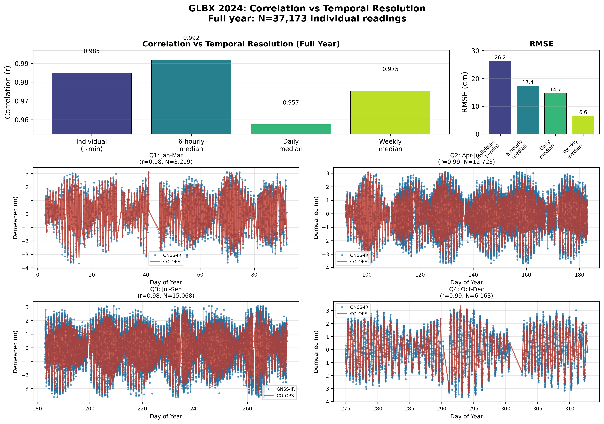

# GNSS-IR Processing Workflow

Python-based workflow for GNSS Interferometric Reflectometry (GNSS-IR) data processing. Downloads RINEX 3 data from the NPS GNSS archive, processes it to calculate reflector heights for water level estimation, and validates results against external reference sources.

This effectively is built on top of, and works as a wrapper of https://github.com/kristinemlarson/gnssrefl 
Was created in hopes of creating more user friendly visualizations, and allowing for one time config files per station to allow visualization and comparison of GNSSIR to nearby reference data. The imagined use case is a set up where cron jobs can be scheduled to update GNSS data as it is uploaded.

## Processing Flow

1. **Download**: RINEX 3 files from NPS GNSS archive (`https://gnss.nps.gov/doi-gnss`)
2. **Convert**: RINEX 3 → RINEX 2.11 using `gfzrnx`
3. **SNR Extraction**: Generate signal-to-noise ratio data with `rinex2snr`
4. **GNSS-IR Processing**: Calculate reflector heights using `gnssir`
5. **Reference Matching**: Find nearby gauges and retrieve water level data
6. **Analysis**: Time lag analysis, correlation statistics, visualization

## Example Output

### Water Level Correlation Analysis

*GLBX station (Bartlett Cove, AK) - Correlation and RMSE analysis at different temporal resolutions comparing GNSS-IR derived water levels to ERDDAP reference gauge.*

### Polar Visualization Animation

*Weekly polar animation showing GNSS-IR retrievals with Fresnel zone reflections overlaid on water level time series.*

## Reference Data Sources

- **USGS**: Stream/tide gauges with water level data (NAVD88/NGVD29/MSL)
- **NOAA CO-OPS**: Tide predictions and water level observations
- **NOAA ERDDAP**: Regional servers (AOOS, PacIOOS, SECOORA) with water level sensors

## Project Structure

```
/project_root/
├── config/                       # Station configurations and tool paths
│   ├── stations_config.json     # Station definitions and reference sources
│   └── tool_paths.json          # External tool paths
├── scripts/
│   ├── process_station.py       # Single entry point for full processing workflow
│   ├── usgs_comparison.py       # USGS gauge comparison with time lag analysis
│   ├── coops_comparison.py      # CO-OPS tide gauge comparison (coastal)
│   ├── generate_erddap_matched.py # ERDDAP data source matching
│   ├── find_reference_stations.py # Reference station discovery
│   ├── core_processing/         # Core processing modules
│   ├── external_apis/           # NOAA CO-OPS and NDBC clients
│   ├── utils/                   # Utilities and helpers
│   └── visualizer/              # Plotting modules
├── dashboard.py                 # Streamlit dashboard
├── dashboard_components/        # Dashboard modules
├── tests/                       # Test suite with real data fixtures
└── data/                        # Data storage (not in git)
```

## Prerequisites

- **Python 3.9+** with packages: pandas, matplotlib, numpy, scipy, dataretrieval, streamlit
- **External Tools**: gfzrnx, gnssrefl package (rinex2snr, gnssir, quickLook)

### Setup

```bash
conda create -n py39 python=3.9
conda activate py39
pip install gnssrefl
pip install -r requirements.txt
```

## Configuration

Each station requires configuration in `config/stations_config.json`. Reference sources are auto-detected based on which sections are configured:

```json
{
  "FORA": {
    "station_id_4char_lower": "fora",
    "ellipsoidal_height_m": 5.123,
    "latitude_deg": 36.1833,
    "longitude_deg": -75.7467,
    "usgs_comparison": {
      "target_usgs_site": "02084472"
    }
  },
  "GLBX": {
    "station_id_4char_lower": "glbx",
    "ellipsoidal_height_m": -12.535,
    "latitude_deg": 58.455146658,
    "longitude_deg": -135.8884838318,
    "external_data_sources": {
      "erddap": {
        "enabled": true,
        "primary_reference": true,
        "station_name": "Bartlett Cove, AK"
      }
    }
  },
  "VALR": {
    "station_id_4char_lower": "valr",
    "ellipsoidal_height_m": 2.456,
    "latitude_deg": 21.3069,
    "longitude_deg": -157.8583,
    "external_data_sources": {
      "noaa_coops": {
        "enabled": true,
        "preferred_stations": ["1612340"],
        "datum": "NAVD88"
      }
    }
  }
}
```

**Reference Source Priority**: ERDDAP → USGS → CO-OPS. If no reference is configured, CO-OPS auto-discovers the nearest tide gauge within 50km.

**Configured Stations**: FORA (North Carolina), GLBX (Alaska), MDAI (Maryland), VALR (Hawaii)

## Usage

```bash
# Process today's data (for cron jobs)
python scripts/process_station.py --station GLBX --today

# Process last 7 days (catch up after gaps)
python scripts/process_station.py --station GLBX --days 7

# Validate configuration before processing
python scripts/process_station.py --station GLBX --year 2024 --validate

# Run full year processing
python scripts/process_station.py --station GLBX --year 2024 --doy_start 1 --doy_end 31

# Launch dashboard
streamlit run dashboard.py
```

### Scheduled Processing (Cron)

Set up daily updates with cron:

```bash
# Edit crontab
crontab -e

# Add daily processing at 6 AM (GNSS data typically available by then)
0 6 * * * cd /path/to/GNSSIRWorkflow-standalone && /path/to/conda/envs/py39/bin/python scripts/process_station.py --station GLBX --today >> logs/glbx_cron.log 2>&1

# Or process multiple stations
0 6 * * * cd /path/to/project && ./scripts/run_daily.sh
```

Example `scripts/run_daily.sh`:
```bash
#!/bin/bash
source /path/to/conda/etc/profile.d/conda.sh
conda activate py39
cd /path/to/GNSSIRWorkflow-standalone

for station in GLBX FORA VALR; do
    python scripts/process_station.py --station $station --today
done
```

### Output

Results are saved to `results_annual/{STATION}/`:
- `{STATION}_{year}_combined_rh.csv` - Reflector heights (water levels)
- `{STATION}_{year}_matched_data.csv` - GNSS-IR matched with reference
- Various plots (time series, polar animations, comparisons)

### Flags

- `--today`: Process current day only
- `--days N`: Process last N days
- `--validate`: Validate configuration and exit
- `--skip_download`: Skip RINEX download if files exist
- `--skip_gnssir`: Skip GNSS-IR processing (use existing results)
- `--skip_comparison`: Skip reference comparison
- `--skip_viz`: Skip visualization

## Testing

```bash
pytest                  # Full test suite
pytest -m unit          # Unit tests only
pytest -m integration   # Integration tests only
pytest -v               # Verbose output
```

Tests use real sample data from GLBX (ERDDAP), MDAI (USGS), and VALR (CO-OPS) stations.

## Adding a New Station

1. Add station info to `config/stations_config.json` (coordinates, antenna height)
2. Run `find_reference_stations.py` to identify nearby USGS, CO-OPS, and ERDDAP sources
3. Add recommended reference configuration to the station's config:
   - For USGS gauges: add `usgs_comparison.target_usgs_site`
   - For CO-OPS tide gauges: add `external_data_sources.noaa_coops.preferred_stations`
   - For ERDDAP: add `external_data_sources.erddap` with server and dataset info
4. Run processing pipeline

**Note**: For coastal stations without configured references, CO-OPS comparison will auto-discover the nearest tide gauge within 50km.

## Environment Variables

The system configures gnssrefl-required environment variables:
- `REFL_CODE`: Points to `gnssrefl_data_workspace/refl_code/`
- `ORBITS`: Points to `gnssrefl_data_workspace/orbits/`

## Documentation

- [Installation Guide](docs/INSTALL.md) - Detailed setup instructions
- [Parameters Reference](docs/params_reference.md) - GNSS-IR parameter tuning guide
- [Methodology](docs/METHODOLOGY.md) - Scientific background and processing details
- [Architecture](docs/ARCHITECTURE.md) - Code structure and module dependencies
- [Changelog](docs/CHANGELOG.md) - Version history

## Acknowledgments

- [gnssrefl](https://github.com/kristinemlarson/gnssrefl) - GNSS-IR processing package
- [gfzrnx](https://gnss.gfz.de/services/gfzrnx) - RINEX format conversion (GFZ Potsdam)
- [USGS Water Data](https://waterdata.usgs.gov/)
- [NOAA CO-OPS](https://tidesandcurrents.noaa.gov/)
- [NOAA NDBC](https://www.ndbc.noaa.gov/)
